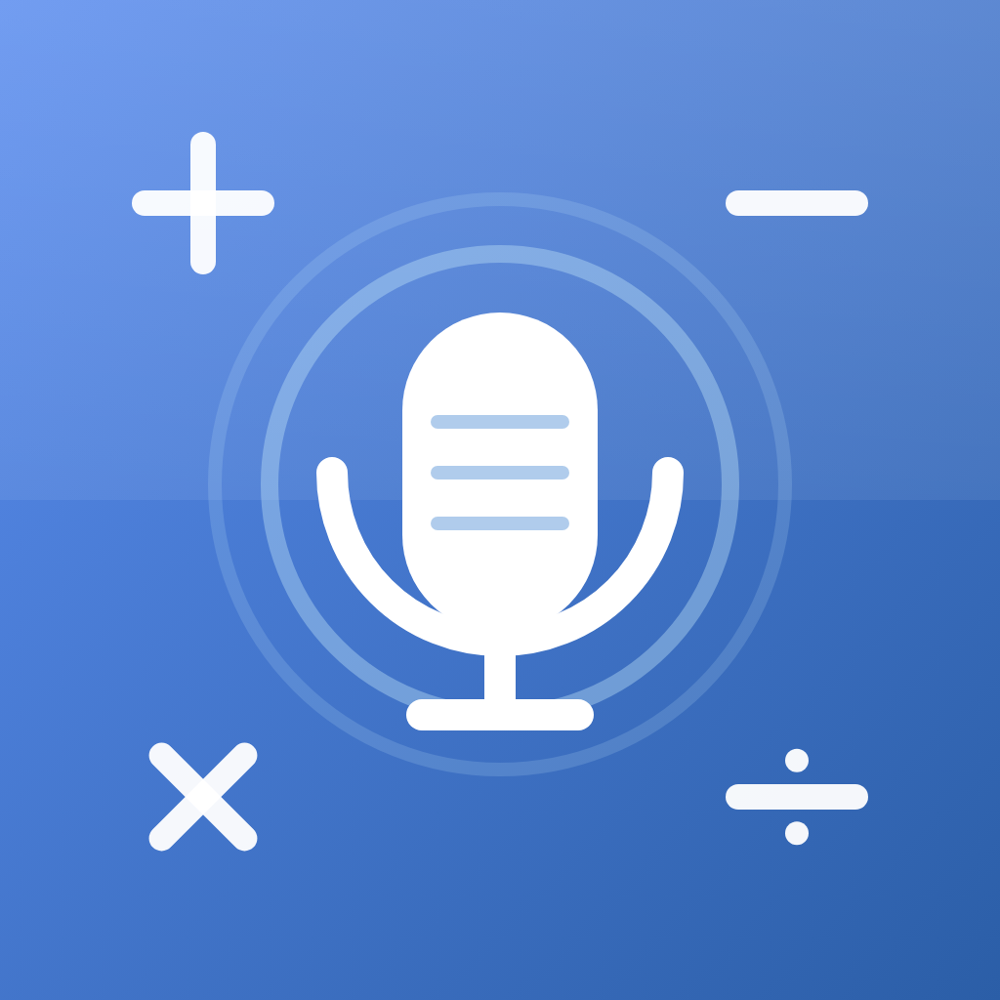

<div align="center">



# Voice Calculator

**Speak your math. Get the answer. Instantly.**

A voice-enabled scientific calculator built with Flutter — say *"twenty five point five times four"* and watch **102** appear before you finish lowering your phone.

[](https://github.com/abinaya-devops/voice_calculator/actions/workflows/deploy-web.yml)
[](https://github.com/abinaya-devops/voice_calculator/actions/workflows/build-apk.yml)


</div>

---

## 🌐 Try it

| | |
|---|---|
| **Web demo** — runs instantly in Chrome/Edge: | **https://abinaya-devops.github.io/voice_calculator/** |
| **Android app** — signed APK, no Play Store needed: | **https://github.com/abinaya-devops/voice_calculator/releases/tag/latest** |

| Web demo | Android APK |
|:---:|:---:|
|  |  |

> **Installing the APK:** Android will ask to *allow installs from this source* and Play Protect may offer a one-time security scan — both are standard steps for apps distributed outside the Play Store.

## 🎙️ Just say it

| You say | You get |
|---|---:|
| *"five plus eleven minus three"* | `13` |
| *"twenty five point five times four"* | `102` |
| *"square root of eighty one"* | `9` |
| *"20 percent of 150"* | `30` |
| *"eight upon two"* (or a dictated `8/2`) | `4` |
| *"clear"* | display cleared |

Compound numbers (*"two thousand five hundred"* → 2500), spoken operators (*"divided by"*, *"into"*, *"upon"*, *"to the power of"*), scientific commands (*"sin 30"*, *"5 factorial"*, *"log of 100"*) — all supported.

## ✨ What's inside

**🧮 A real math engine, not string-splitting**
- Hand-written tokenizer + recursive-descent parser with correct operator precedence, parentheses, unary minus, and implicit multiplication (`2(3+4)`, `2π`)
- Real-calculator percent semantics: `200+10%` → **220**, not 210
- Full scientific set: sin/cos/tan with DEG/RAD toggle, inverses, ln/log, √, x², x³, n!, mod, 1/x, π, e, ANS
- Clean output — no `0.30000000000000004`, no trailing `.0`

**🛡️ Voice that survives real-world speech**
- Android's recognizer sometimes returns *partial results glued together* — saying "8/2" can arrive as `88/8/28/2`. The app detects and rejects these glitches before they ever reach the display
- **⚡ Fast mode**: the live transcript is evaluated ~0.6s after you pause speaking — no waiting for the recognizer's slow "final" response; a corrected final result still overrides it if needed
- Live transcript, "Heard …" confirmation, and voice commands (*"clear"*, *"delete"*)

**🎨 A UI that feels finished**
- Cornflower/ice-blue Material 3 theme, Saira typeface, light & dark modes (persisted)
- Canvas-drawn app logo, calculator-style key sounds (synthesized in code), haptic feedback
- History with persistence, copy & share, responsive two-pane layout for tablets and landscape

## 🏗️ Engineering highlights

| Area | Approach |
|---|---|
| **Expression parsing** | Recursive-descent parser (`lib/core/expression_engine.dart`) — precedence, associativity, and percent semantics handled at the grammar level |
| **Speech → math** | Layered normalization pipeline (`lib/core/voice_parser.dart`): filler removal, number-word compounding, spoken-operator mapping, glitch defense |
| **CI/CD** | Two GitHub Actions pipelines: web → GitHub Pages, Android → **code-signed APK** published to a rolling `latest` release on every push |
| **Release signing** | Stable keystore restored in CI from an AES-256-encrypted blob + repo secret, so updates install over previous versions |
| **Quality gates** | 29 automated tests (engine, voice parser, glitch regressions) run in CI before any build |

## 🚀 Getting started

```bash
git clone https://github.com/abinaya-devops/voice_calculator.git
cd voice_calculator
flutter pub get
flutter run
```

> The microphone needs a real device or a Chromium-based browser; Android emulators may lack a speech-recognition service.

**Run the tests**

```bash
flutter test
```

## 📁 Project structure

```
lib/
├── main.dart                    # UI, theme, keypad, voice session flow
├── core/
│   ├── expression_engine.dart   # tokenizer + recursive-descent parser
│   ├── voice_parser.dart        # speech → math expression
│   └── key_sounds.dart          # synthesized key-press sounds
└── widgets/
    └── app_logo.dart            # canvas-drawn logo (also renders app icons)

tool/generate_assets_test.dart   # renders logo PNGs + sound WAVs from code
.github/workflows/               # web deploy + signed APK pipelines
```

## 👤 Author

**Abinaya M** — GitHub: [@abinaya-devops](https://github.com/abinaya-devops)
